<h1>Weather Station</h1>
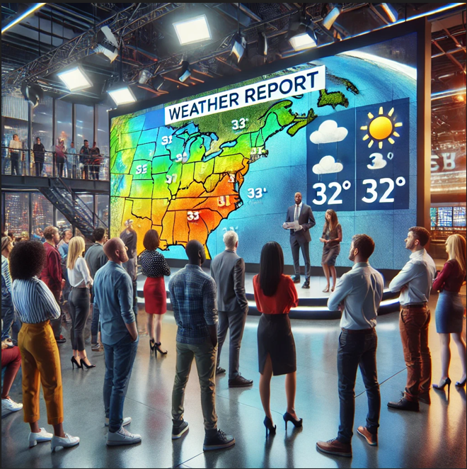
 <i>Generated by AI</i> 

<h1 id="contents">Table of Contents</h1>

- [1.Intro](#1.intro)
- [2.Design](#2.Design)
  - [2.1.SpringBoot](#2.1.SpringBoot)
- [3.Implementation](#3.Implementation)
- [4.Project Design](#4.ProjectDesign)
  - [4.1.Choosing our Api template](#4.1APiTemplate)
    - [4.1.1.Open Weather API](#4.1.1.APiTemplate_1)
    - [4.1.2.weather api](#4.1.2.APiTemplate_2)
  - [4.2.testing our first example on Postman](#4.2.Postman)
  - [4.3.testing our first example on java](#4.3.testingjava)
    - [4.3.1.Creating our Model](#4.3.1.ModelDesign)
    - [4.3.2.Creating our Service](#4.3.2.ServiceDesgin)
    - [4.3.3.Creating our Controller](#4.3.3.ControllerDesgin)
    - [4.3.4.Creating our FrontEnd Display](#4.3.4.FrontEndDisplay)

<h1 id="1.intro">Project Introduction - Weather Station </h1>

This Project is to give an educational foundation to java mainly, spring boot framework and front-end design with a flair of AI. 

<b>Why weather?</b> 
Weather is a common issue in our location, changes regular, but what about clothes this can be difficult with the change of weather and the style or practical design we wish to use for our day-to-day travels. Comfort is the main mission for us and the proudness of how we look in our day to day.  

This project will tackle this question from a standpoint of how to use AI to learn from weather on a day to day and run a suggestion with the list of clothes we have in our wardrobe as is how the fridge now knows what is the contents of what we consumer.  

<b>What is the aim?</b> 
The aim of this project is to try to see, can we help answer this question of organizing our lives more around weather?  

 <i>Generated by AI</i> 

<h1 id="2.Design">2.Choosing the Tools for Java Project using Springboot</h1>
<h2 id="2.1.SpringBoot">2.1.SpringBoot</h2>

<b>Link - https://spring.io/quickstart</b> 
Generate the following - https://start.spring.io/

<h1 id="3.Implementation"></h1>

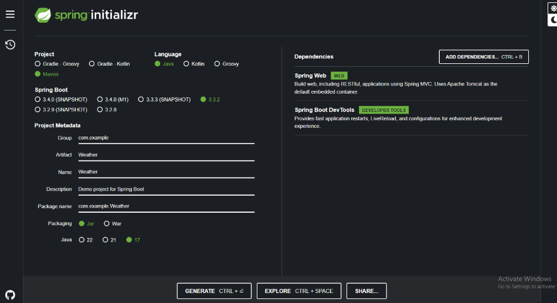

Once you have the following updated   
Generate and download to personal computer  
Our new file is downloaded and unzipped. To now create a file, we will be working on.   

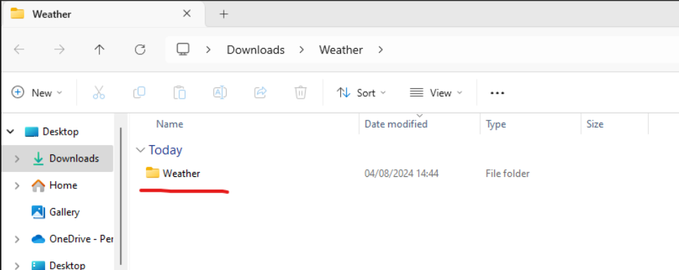

New file you can name but ours is different ->  

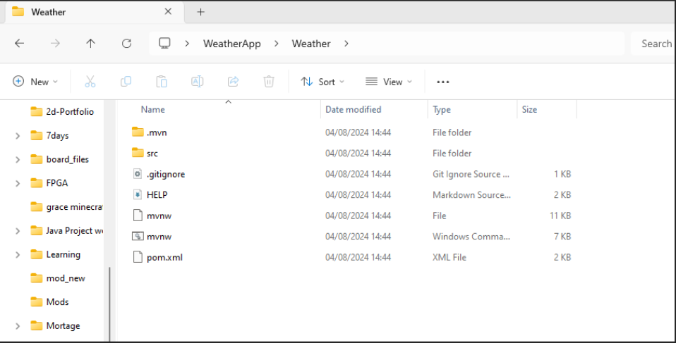
Open up IntelliJ and here we can open the project   

Once we located and selected the folder with all the following spring boot project, we then load this to our IntelliJ.  
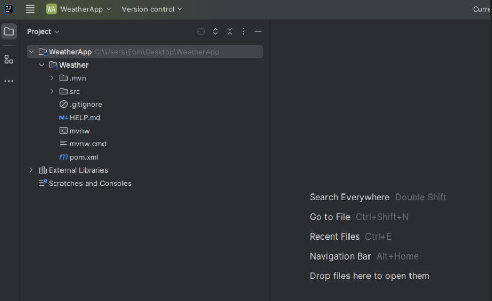

This is now completed.   
Second step is to upload to our git hub so that all changes done we can record and try.   

<h2 id="2.2.git">2.2.How to start our git creation</h2>
Using copilot -> <b>Link - https://chatgpt.com/g/g-2DQzU5UZl-code-copilot/c/e4cdf976-8fe0-467f-a27c-615b0fa5d688</b>

First thing is first to test that git is installed on our machine we need to first check by opening cmd if on windows.  

The command -> C:\Users\Eoin\Desktop\WeatherApp>git version  
The expected response -> git version 2.43.0. windows.1  

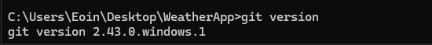

We will need to run this on PowerShell as the commands we used did not recognise. Moving this PowerShell, we will need to again locate the directory. 

Using basic windows terminal commands of cd and then the file path.   
- PS C:\Users\Eoin\Desktop\WeatherApp> gh repo create WeatherStation --private --source=.
- PS C:\Users\Eoin\Desktop\WeatherApp> cd Weather
- PS C:\Users\Eoin\Desktop\WeatherApp\Weather> git init
- PS C:\Users\Eoin\Desktop\WeatherApp\Weather> git status
- PS C:\Users\Eoin\Desktop\WeatherApp\Weather> gh repo create WeatherStation
- PS C:\Users\Eoin\Desktop\WeatherApp\Weather> echo "# Weather Station" >> README.md
- PS C:\Users\Eoin\Desktop\WeatherApp\Weather> git add README.md
- PS C:\Users\Eoin\Desktop\WeatherApp\Weather> git commit -m "Initial commit
  
Now our new repository is now up and running but not the main code
 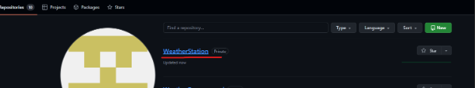  

- git config --global user.name "Your Name"
- git config --global user.email "your-email@example.com"
- Create a new directory
- mkdir my-new-repo
- cd my-new-repo
- git init
 
Now GIT was created but not our project was added to this repository.   
The errors seen after the repository was created  
 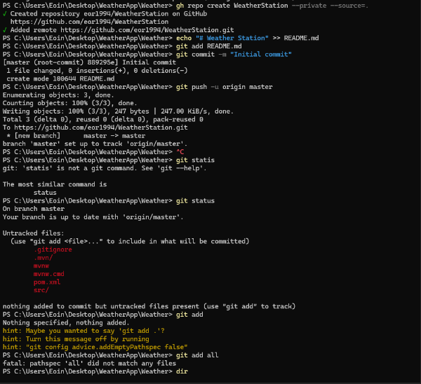  

So, we had to reinitialize the repository and push. 
 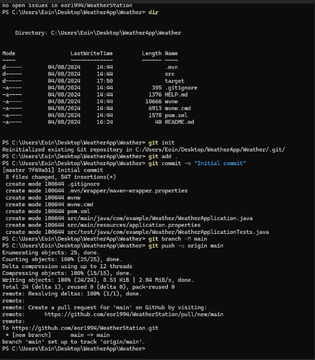  

Now we checked our git hub site to see if this worked.  yes, as you can see but this is on a different branch called Main.   
 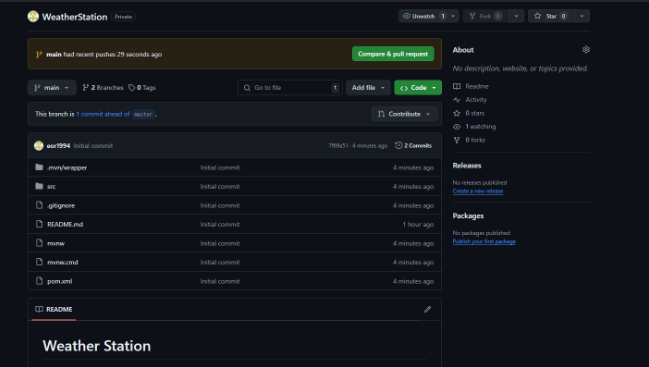  

Our project is here and ready to work. We now must start creating our api project and test that the values we want works.   
Our next step is to now work on java and the springboot framework.   

<h1 id="ProjectDesign">4.Planning our Project Design.</h1>  
In this section we will look at how to design our project and the many steps to achieve this part of the project of getting our api to work and to display the info.  
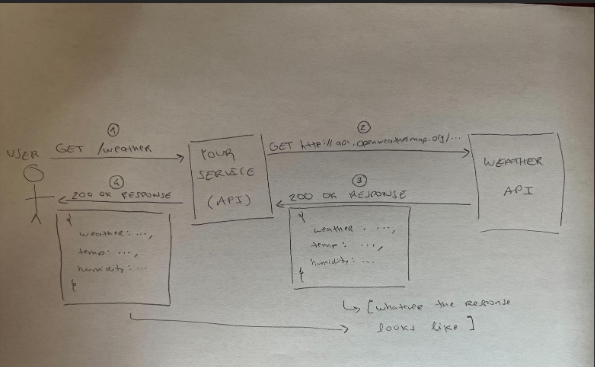

<h2 id="4.1APiTemplate">4.1.Choosing our Api template</h2>  

In this section we need to decide on the weather api we want to use. There are many signup options and what each one provided in their responses.   

The api we have a choice of are two we had picked. During this process moved to the second one as the response and using is the easiest.   

Link 1 =  https://openweathermap.org/api  
Link 2 = https://www.weatherapi.com/api-explorer.aspx  

<h3 id="4.1.1.APiTemplate_1">4.1.1.Open Weather API</h3>  
This api we went using but the second in the list was to compare as both do the same thing. This however is suggested in many examples and here we used for the main code in our project. 

<h3 id="4.1.2.APiTemplate_2">4.1.2.weather api</h3>  
Api 2 - https://www.weatherapi.com/api-explorer.aspx
 

Once we signed up on free trial, we can create our api token to use when making calls. We tested with this model as suggested by many examples used but also investigeted using the other for testing purposes. 
 
In post man we copied the main link and here added search fields with the tag to host our token to access the data and show in our test examples. 
 
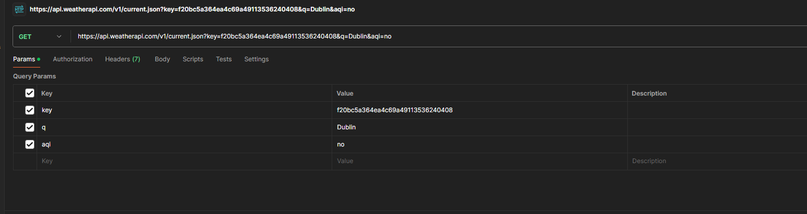
 

the output is the model we will base our java code off on what we wisht to see on our presentation and data. 

<h2 id="4.2.Postman">4.2.Comparing our first example on Postman</h2>  
In post man here we take the following template provided by the api documentation. We can create our request and put the following question in the endpoint to get the details we need. 

 
Now we run our request to the api endpoint and check to see what informtion we get, the details should follow the document guide.
 
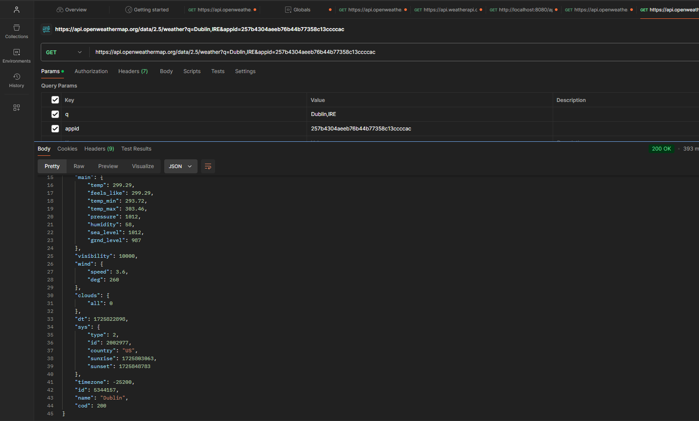
Here you can see in the response it provides a large amount of information, in our project we only wish to have the temperature, location, latitude, longitude and country. 
 
All other details we can change but in our firts time to get this to display on our front end and to manipulate the data to help move to our AI recommendation part of the Project, we will discuss this later. 
 
For now we can confirm this works with our token and the details we have added to the api call. No errors, so lets now mimic the same in our java and to present in a readable point of view.  

<h2 id="4.3.testingjava">4.3.testing our first example on java</h2>  

Url that is used -> https://api.openweathermap.org/data/2.5/weather 

Let's navigate to our java src and start creating our structure of what we need and why. 
Our first step is to make sure our project works and builds to the same as how we ran this in our postman application. 

We first start with the models, we need this as a object of what java is to expect and how to pass this information to the rest of the project. We created this in the format of the API. 
 
Our java project will need to operate like the following flow design. Our subheadings breaks down each design below.  
├── src/ 

│   ├── main/ 

│   │   ├── java/ 

│   │   │   └── com.example.weather/ 

│   │   │       ├── WeatherApiApplication.java 

│   │   │       ├── controller/ 

│   │   │       │   └── WeatherController.java 

│   │   │       └── model/ 

│   │   │           └── WeatherResponse.java 

│   │   └── resources/ 

│   │       └── application.properties 

 
<h3 id="4.3.0.FirstJavaAPI">4.3.0.First API Call in Java</h3>  
In java we need to test this on how we can call before we format this in a more organized structure which we will go into details below as shown in our design flow above. 

In the project we have the url endpoint, we have the token and we know the information we would like to show. Our code shows this belwo here. 
 
path -> src/main/java/com/example/Weather/WeatherApplication.java

Now to call the api with using http connection methods.
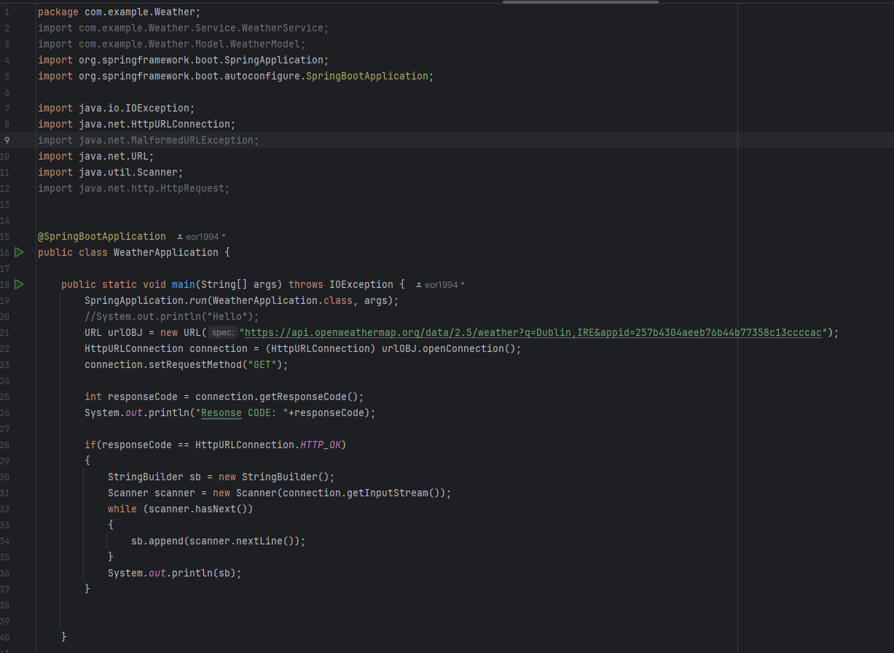   
The result shows this in our browser as its using our spring boot. We use the default localhost address, this allowed us to see the type of json details we will display later on in the project. Our IDE showed this on our project below 
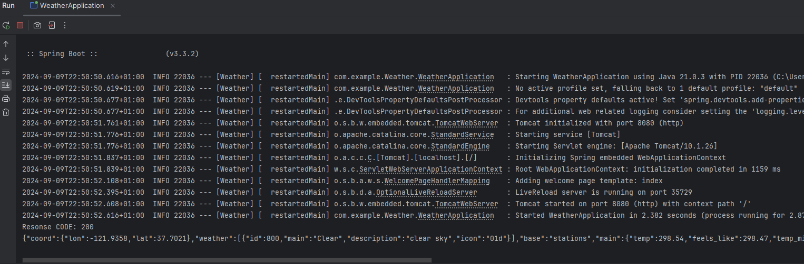   

Now we know what to expect that the format works with our token but with using our structure with modelm controller and service with springboot, we can generate the same on a browser. As shown below. 

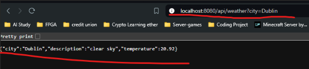  

<h3 id="4.3.1.ModelDesign">4.3.1.Creating our Model</h3>  

Headers - https://api.openweathermap.org/data/2.5/weather?q=Dublin,IRE&appid={{apiKey}} 
 

The design has the following highlighted. 

CODE:
public class WeatherModel {
    private String city; -city name
    private String country; - country name
    private String description; - desciption 
    private double temperature; - temperatiure
    //the mapping of the location
    private double latitude;
    private double longitude;
}
 
the mode what is it ? 
Model -> The Model represents the data that contain the attributes related to the application’s domain. 
In our weather app, the model is used to represent the weather data (like city name, temperature, latitude, longitude, etc.) that we are fetching from the weather API.

Structure in flow is shown as below:
 Model Class             | 

+----------------------------+ 

| - Create WeatherResponse   | 

|   class with fields:       | 

|   - city                   | 

|   - description            | 

|   - temperature            | 

+----------------------------+ 

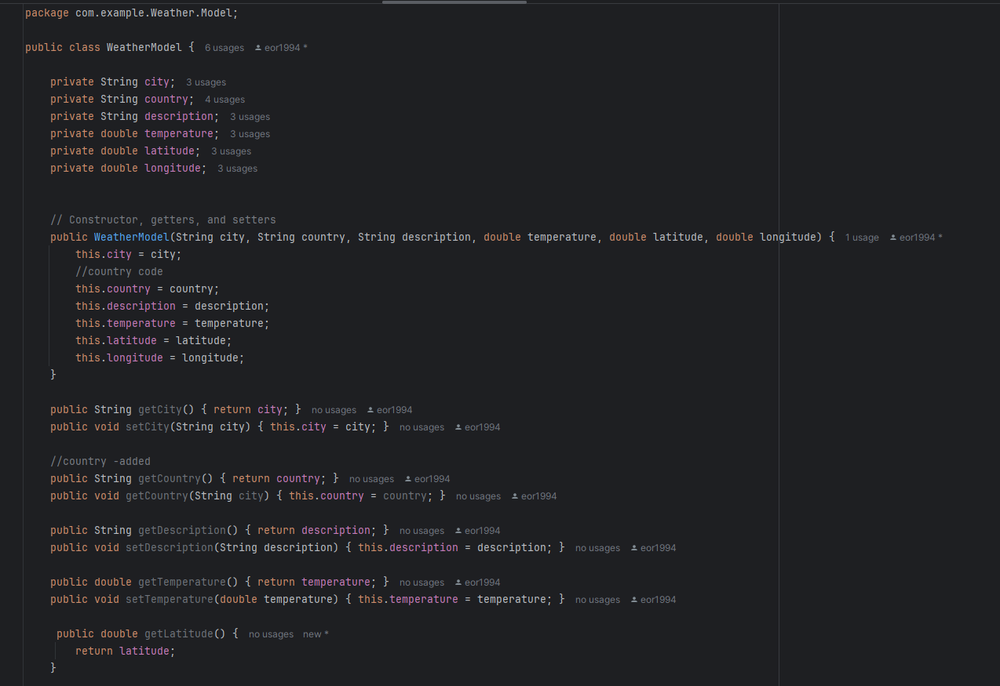
 

<h3 id="4.3.2.ServiceDesgin">4.3.2.Creating our Service</h3>  

<h3 id="#4.3.3.ControllerDesgin">4.3.3.Creating our Controller</h3>  

<h3 id="#4.3.4.FrontEndDisplay">4.3.4.Creating our FrontEnd Display</h3>  

<h3 id="#4.3.5.Output">4.3.5.Showing our Result</h3>  
In this section we will now show the following output on our work and how we got to this resolution. 

Here you can see two options to select from, both of these will add to our api search. Here it will pass and java will do the rest.  
The followin will return parse and then display the fields we only wanted to show to our users. 
The first step you can enter city name in text, the select the country by its country code.  
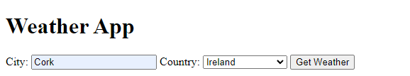

we can now hit search and it will now show the details. 
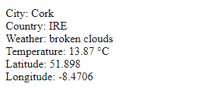
 
You can see that we added this from the fields from our java and how its called in html to display this info. 
Our project now works. 

Testing this more we noted that this is only searching by the city name, but if there was a duplicate the api notes that it will as a default use USA. This is a problem when using this but an issue we can fix later by using the lat and long instead. 

 
